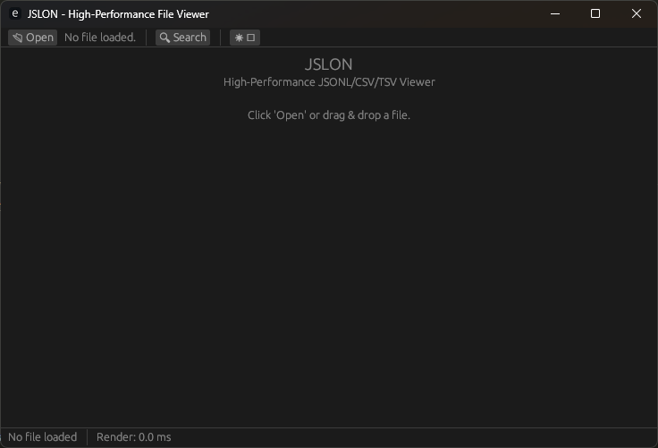

# JSLON

A blazing fast, memory-efficient GUI viewer for large JSONL, CSV and TSV files.




## Features

- **Multi-platform** - You just need Rust to build the binary.
- **Virtualized rendering** - Only visible rows are processed, making it efficient for gigabyte-sized files
- **Memory-mapped file access** - Files are loaded instantly regardless of size
- **Smart search** - Fast keyword search with term highlighting and navigation
- **Collapsible rows** - Expand only the entries you care about
- **Dark/Light mode** - Choose your preferred theme

## Requirements

- Rust 1.60 or later
- Cargo

## Building from Source

### Quick Start

```bash
# Clone the repository
git https://github.com/skirdey-inflection/jslon
cd jslon

# Build in debug mode
cargo build --release

# Run the application
cargo run --release
```

### Build Release Version

```bash
cargo build --release
```

The executable will be available at `target/release/jslon` (or `jslon.exe` on Windows).

## Manual Execution

If you prefer not to create a bundle, you can run the release build directly:

### macOS/Linux

```bash
./target/release/jslon
```

### Windows

```bash
.\target\release\jslon.exe
```